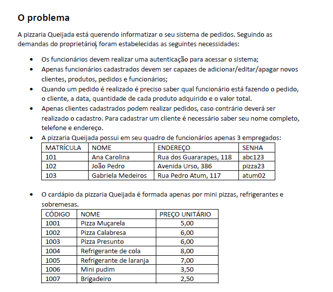

# Pizzaria Queijada

## Sobre

Trabalho de Programação II - 2021.1.

A pizzaria Queijada está querendo informatizar o seu sistema de pedidos. Seguindo as demandas do proprietário

## Telas

## Tecnologias

Java

## Status

Projeto em Desenvolvimento.

## Desenvolvedores

[Marcílio Júnior](https://github.com/MJr0019), 

[Igor Soares](https://github.com/isobrrj)
